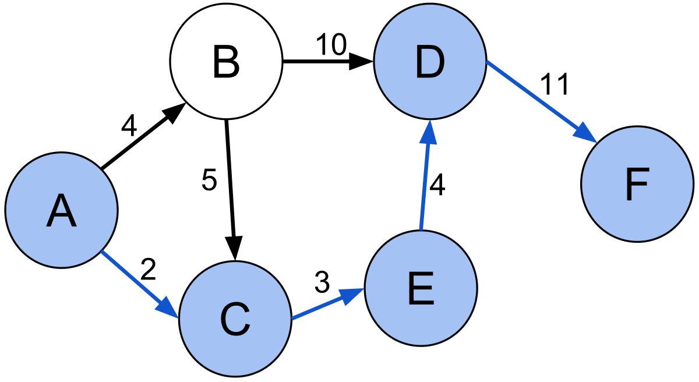

# Shortest paths problem
  
             
## Structure of the project:
* analysis of the algorithms and demonstration of the results - [report](https://github.com/kislN/graph_lab_2/blob/master/report.ipynb)
* implementation of the algorithms:
  * [A star algorithm](https://github.com/kislN/graph_lab_2/blob/master/a_star.h)
  * [Dijkstra's algorithm](https://github.com/kislN/graph_lab_2/blob/master/dijkstra.h)
  * [Bellman–Ford algorithm](https://github.com/kislN/graph_lab_2/blob/master/bellman-ford.h)
  * [Johnson's algorithm](https://github.com/kislN/graph_lab_2/blob/master/johnson.h)
  * [Floyd–Warshall algorithm](https://github.com/kislN/graph_lab_2/blob/master/floyd–warshall.h)
  * [Matrix Maltiplication](https://github.com/kislN/graph_lab_2/blob/master/seidel.h)
* structure of [the Graph](https://github.com/kislN/graph_lab_2/blob/master/Graph.h)
* counting of [the connected components](https://github.com/kislN/graph_lab_2/blob/master/connected_comp.h)
* [stress tests](https://github.com/kislN/graph_lab_2/blob/master/stress_tests.h)
* [experiments](https://github.com/kislN/graph_lab_2/blob/master/experiments.h)
* experiments with [real-life graphs](https://github.com/kislN/graph_lab_2/blob/master/real_graph.h)
* input and output [data](https://github.com/kislN/graph_lab_2/tree/master/data)
  
